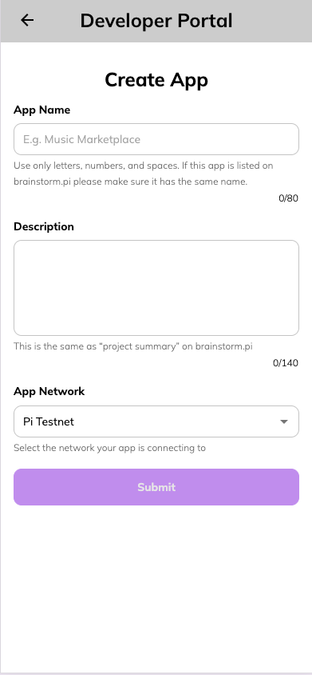
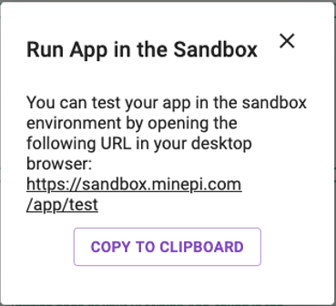
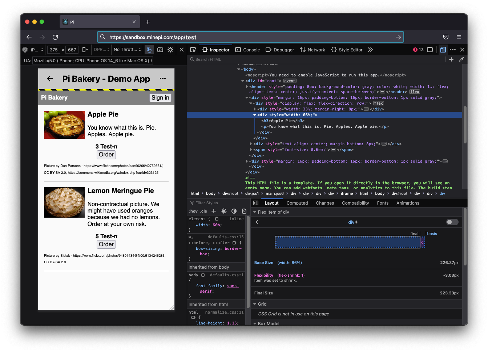

# Pi Platform Demo App: Development Environment

The following document explains how to set up a development environment and run the Pi Platform Demo App in the
sandbox environment.

## Prerequisites:

This guides assumes you have the following two tools installed on your development machine:

- a NodeJS installation (recommended version: Node v16 LTS **or lower**)
  - if you're running with node 17 or higher, you'll need to use `yarn startNode17` to work around [this issue](https://github.com/facebook/create-react-app/issues/11562)
- a functional Docker or Mongosh installation


## 1. Clone the Github repo and navigate to the project directory:

```sh
git clone git@github.com:pi-apps/platform-demo-app.git
cd platform-demo-app
```


## 2. Register your app on the developer portal

Open `develop.pi` in the Pi Browser, on your mobile phone, and go through the prerequisite steps
(e.g verifying your email address).

Create a new app by clicking the "Register an App" button.

The Process is as follows:

- Register an App:
  - Name: The name of your app
  - Description: A public user-facing description of your app
  - Network: select "Pi Testnet"
  - Submit the form



<br/>

This will bring you to the App Dashboard, from this screen you can continue the development of the demo app. 
 
- App Checklist: Complete Steps 1-5 to prepare the app for launch in development mode
  - Step 1: "Register an App" was completed previously
  - Step 2: Configure App Hosting - Hosting type: select "Self hosted"
  - Step 3: Create a Pi Wallet, see this [Pi Wallet Introduction](https://pi-apps.github.io/community-developer-guide/docs/importantTopics/paymentFlow/piWallet/) for more information
  - Step 4: Review this documentation and our [Community Developer Guide](https://pi-apps.github.io/community-developer-guide/) for help getting setup
  - Step 5: Configure App Development URL: the URL on which your app is running on your development environment. If your using the default
    setup for the demo app frontend, this is "http://localhost:3314. **Note:** If you need, you can change the port by specifying it in
    `frontend/.env` file, as the value of the `PORT` environment variable.
 
 
 
 <br/>
 
- App Configuration: Additional information that can be adjusted
  - Whitelisted usernames: you can leave this blank at this point
  - App URL: This is irrelevant for development. You can use the intended production URL of your app (e.g "https://mydemoapp.com"),
    or simply set it up to an example value (e.g "https://example.com"). This must be an HTTPs URL
  - Development URL: The URL on which your app is running on your development environment. If your using the default
    setup for the demo 

## 3. Run the frontend development server

Setup the frontend app following the [Pi Demo App Frontend documentation](../frontend/README.md).


## 4. Run the backend development server

Setup backend server following the [Pi Demo App Backend documentation](../backend/README.md).

## 5. Open the app in the Sandbox

To test all of the Demo App features, you need to run it in the Pi Sandbox.

The purpose of the Sandbox is to enable running and debugging a Pi App in a desktop browser, although a Pi App
is meant to be opened in the Pi Browser by end-users.

For more information on the Sandbox head to our [Community Developer Guide](https://pi-apps.github.io/community-developer-guide/docs/gettingStarted/piAppPlatform/piAppPlatformSDK/#the-sandbox-flag).

Lastly, **on your desktop browser** open the sandbox URL from Step 6 of App Checklist:





> **WARNING**
>
> The demo app uses express session cookies which, in the Sandbox environment, are not correctly saved on the client on some browsers.
> To properly test all of the features of the Demo App, we recommend you to open the sandbox app using Mozilla Firefox.

#### Congratulations! The app should work in the developer portal and enable you to sign in, place an order and make a testnet payment.

# More Information - Developing on Pi
For guidelines on how to register an app and get the Sandbox URL, please refer to the
[Pi Developer Guide](https://pi-apps.github.io/community-developer-guide/).
